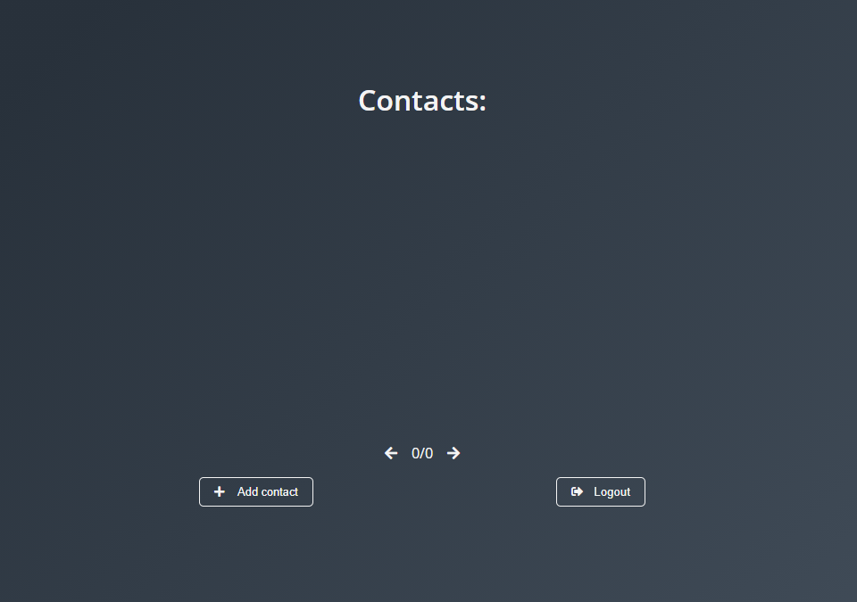
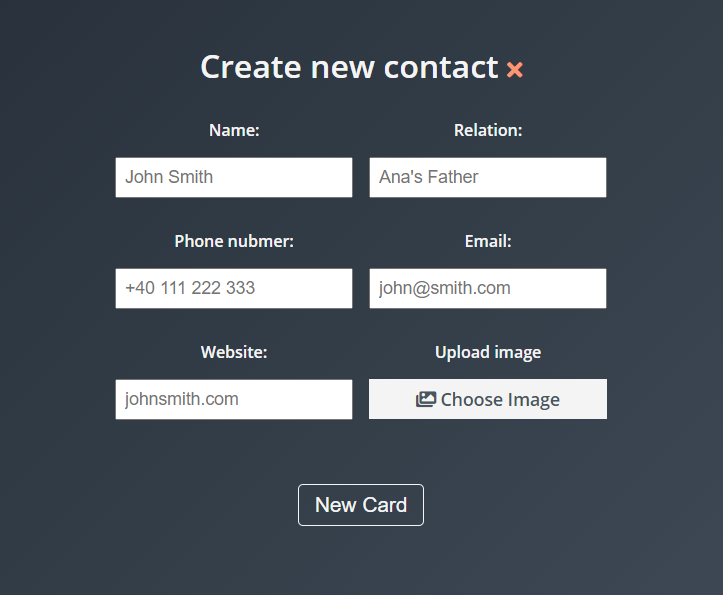
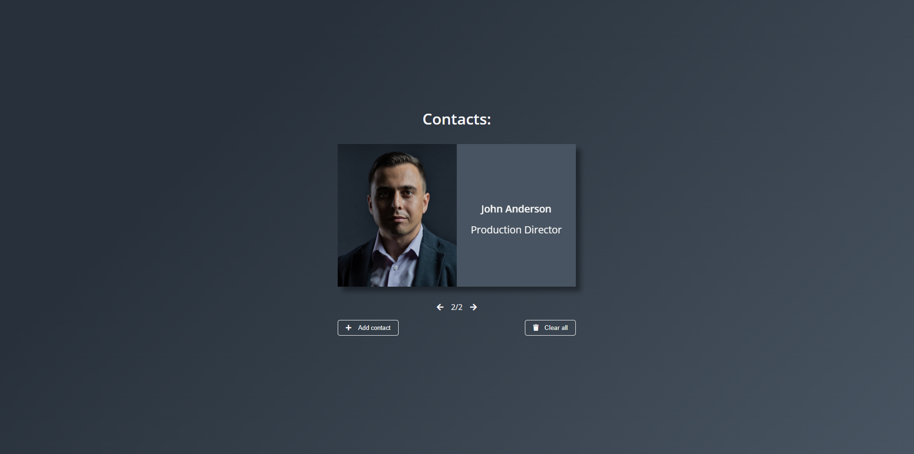

# Contacts

<h3> About the app </h3>
Simple web app where you can store your contacts. You can add phone number, email address, personal website and an image of the contact.
Application was built using HTML5, CSS3 and javaScript on the front-end and node js with express on back-end. For authentication i used json web token and MongoDb for database.

## How to use the application

First page is going to ask you for an user and a password. If you have no account, press on sign up button and your account is going to be created. 
If you already have an accout press on log in!

**After successfully logging in you are prompted by this page:**

<strong>By pressing the add contact button, a new window will be displayed</strong>

**After adding a contact, the contact is going to be added to the data base and listed here:**

